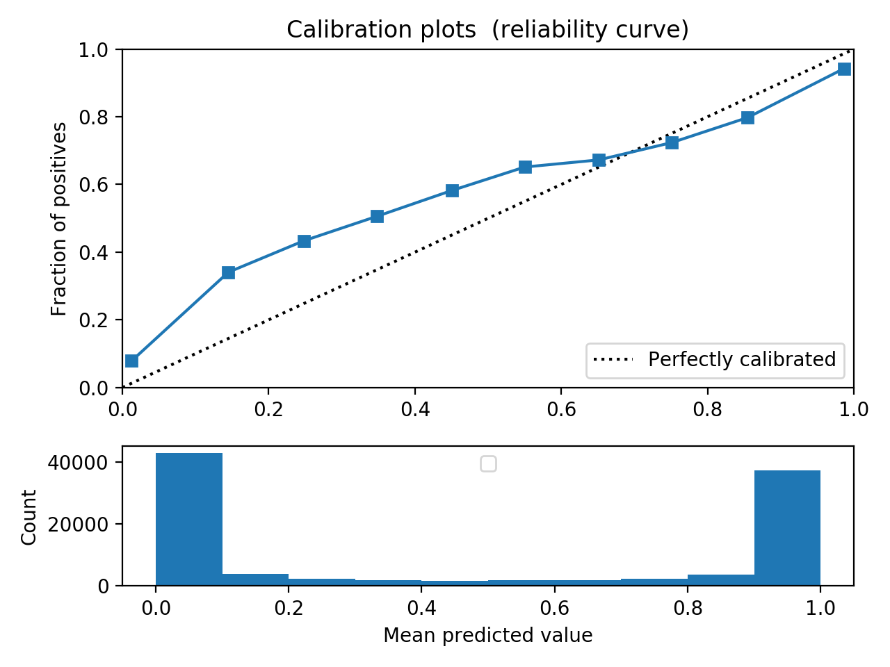

# Platt Scaling

Platt scaling transformer (based on [Platt 1999](https://www.researchgate.net/profile/John_Platt/publication/2594015_Probabilistic_Outputs_for_Support_Vector_Machines_and_Comparisons_to_Regularized_Likelihood_Methods/links/004635154cff5262d6000000.pdf)).

